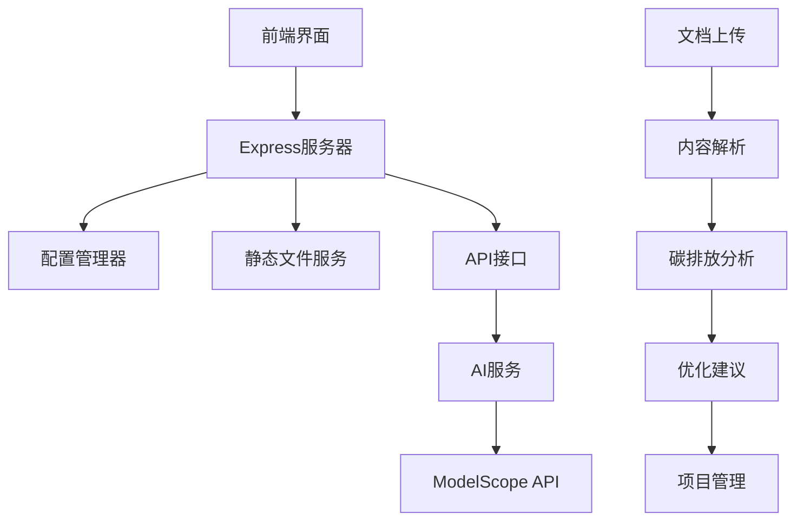

# 碳排放管理系统 (EMS 2.2)

<div align="center">
  
  
  
  
</div>

## 🌱 项目简介

智能碳排放管理系统是一个基于AI的环境管理平台，帮助企业和组织分析、管理和优化其碳足迹。系统集成了先进的AI分析能力，提供从数据上传到执行优化的完整解决方案。

### ✨ 主要特性

- 🤖 **AI智能分析**: 基于DeepSeek-V3模型的深度碳排放分析
- 📊 **多维度管理**: Kanban看板、Lean优化、Scrum执行三大管理模块
- 📁 **多格式支持**: 支持PDF、DOC、DOCX、TXT文档上传分析
- 💬 **实时AI对话**: 智能助手提供专业环保建议
- 📱 **响应式设计**: 完美支持移动端和桌面端
- 🚀 **一键部署**: 优化用于Railway平台快速部署

## 🏗️ 系统架构



## 🎯 功能模块

### 1. 📤 文档上传模块
- 支持拖拽上传和点击上传
- 智能文档内容解析
- AI自动数据补全
- 实时处理状态反馈

### 2. 📋 Kanban分析模块
- 可视化碳排放流程
- 交互式数据展示
- AI智能问答功能
- 对话历史记录

### 3. ⚡ Lean优化模块
- 智能优化建议生成
- 方案对比分析
- 承诺时间线保障
- 深度AI分析

### 4. 🎯 Scrum执行模块
- 任务分解与分配
- 执行计划生成
- 进度跟踪管理
- 团队协作工具

## 🚀 快速开始

### 方式一：Railway一键部署 (推荐)

1. **Fork本仓库到您的GitHub**
2. **连接Railway**:
   - 访问 [Railway.app](https://railway.app)
   - 选择 "New Project" → "Deploy from GitHub repo"
3. **设置环境变量** (可选，系统有内置默认值):
   ```
   AI_API_KEY=your-api-key
   AI_BASE_URL=https://api-inference.modelscope.cn/v1
   AI_MODEL=deepseek-ai/DeepSeek-V3
   ```
4. **等待自动部署完成**

### 方式二：本地开发

```bash
# 克隆项目
git clone <your-repo-url>
cd ems-2.2

# 安装依赖
npm install

# 启动开发服务器
npm run dev

# 或使用启动脚本
./start.sh
```

## 🔧 环境配置

### 必需配置
- `NODE_ENV`: 运行环境 (默认: production)
- `PORT`: 服务端口 (默认: 3000)

### AI功能配置 (可选)
- `AI_API_KEY`: AI服务密钥
- `AI_BASE_URL`: AI服务地址
- `AI_MODEL`: AI模型名称

> 💡 **提示**: 系统内置了默认配置，无需环境变量即可运行。设置环境变量可以使用自己的AI服务。

## 📁 项目结构

```
ems-2.2/
├── 🚀 部署配置
│   ├── package.json          # 项目配置
│   ├── server.js             # Express服务器
│   ├── railway.toml          # Railway配置
│   ├── start.sh              # 启动脚本
│   └── check-deployment.js   # 部署检查
│
├── 🎨 前端资源
│   ├── index.html            # 主页面
│   ├── index_improved.html   # 改进版页面
│   ├── styles.css            # 主样式
│   └── improvements.css      # 改进样式
│
├── 💻 脚本文件
│   ├── config.js             # 配置管理
│   ├── script_enhanced.js    # 核心功能
│   ├── script.js             # 基础功能
│   └── script_improvements.js # 改进功能
│
└── 📚 文档
    ├── README.md             # 项目说明
    ├── README-DEPLOYMENT.md  # 部署指南
    └── env.example           # 环境变量示例
```

## 🛠️ 技术栈

### 前端技术
- **HTML5 + CSS3**: 现代化界面设计
- **JavaScript (ES6+)**: 交互逻辑实现
- **Font Awesome**: 图标库
- **响应式设计**: 移动端适配

### 后端技术
- **Node.js**: 服务器运行时
- **Express.js**: Web框架
- **Compression**: GZIP压缩
- **Helmet**: 安全中间件
- **CORS**: 跨域处理

### AI服务
- **ModelScope API**: AI推理服务
- **DeepSeek-V3**: 大语言模型
- **实时对话**: 智能问答系统

### 部署平台
- **Railway**: 云部署平台
- **GitHub**: 代码托管与CI/CD
- **CDN**: 静态资源加速

## 📊 核心功能详解

### 智能文档分析
系统可以智能识别不同类型的产品文档，并根据行业特点进行针对性分析：

- **电子产品**: 关注能耗效率、材料回收率
- **纺织服装**: 重点分析水资源使用、化学品管理
- **食品饮料**: 专注包装减量、可持续农业
- **汽车运输**: 燃油效率、电动化转型
- **建筑材料**: 绿色建材、能效标准

### AI优化建议
基于实际数据生成个性化优化方案：

- **供应链优化**: 本地化采购、绿色供应商
- **生产工艺改进**: 清洁能源、智能制造
- **物流网络优化**: 路线规划、新能源运输
- **全生命周期管理**: 从原料到回收的完整链条

### 项目管理集成
将环保优化与项目管理最佳实践结合：

- **看板管理**: 可视化工作流程
- **精益思维**: 消除浪费、持续改进
- **敏捷执行**: 迭代优化、快速响应

## 🔍 部署验证

使用内置的部署检查工具验证配置：

```bash
node check-deployment.js
```

检查项目包括：
- ✅ 文件完整性
- ✅ 依赖配置
- ✅ 环境变量
- ✅ 服务健康状态
- ✅ Railway配置

## 🌟 使用示例

### 1. 上传文档
将您的产品设计文档拖拽到上传区域，系统会自动解析内容并识别产品类型。

### 2. AI智能分析
系统基于文档内容进行碳排放分析，生成详细的排放报告和改进建议。

### 3. 交互式优化
通过AI对话功能，深入了解每个环节的优化方案，获得专业的环保建议。

### 4. 执行管理
使用项目管理功能将优化建议转化为具体的执行计划和任务分配。

## 🤝 贡献指南

1. Fork本仓库
2. 创建特性分支 (`git checkout -b feature/AmazingFeature`)
3. 提交更改 (`git commit -m 'Add some AmazingFeature'`)
4. 推送到分支 (`git push origin feature/AmazingFeature`)
5. 开启Pull Request

## 📄 许可证

本项目采用MIT许可证 - 详见 [LICENSE](LICENSE) 文件

## 🆘 支持与反馈

- 📚 **文档**: [详细部署指南](README-DEPLOYMENT.md)
- 🐛 **问题反馈**: [GitHub Issues](https://github.com/your-username/ems-2.2/issues)
- 💬 **讨论交流**: [GitHub Discussions](https://github.com/your-username/ems-2.2/discussions)
- 📧 **联系我们**: support@example.com

## 🌍 环保承诺

通过使用本系统，您正在为全球碳减排事业贡献力量。每一个优化建议的实施，都是对地球环境保护的积极行动。

---

<div align="center">
  <strong>让科技赋能环保，让AI助力碳中和 🌱</strong>
</div>
